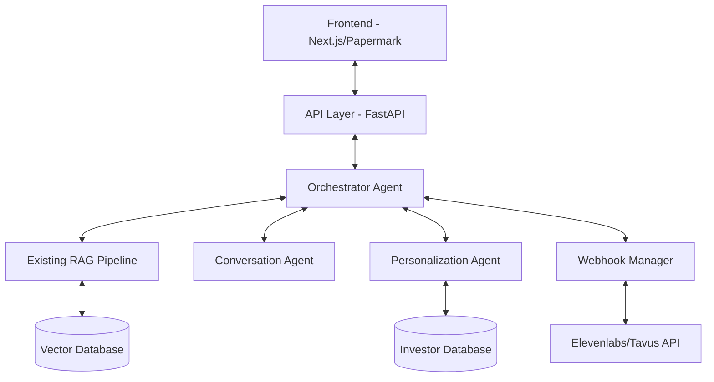
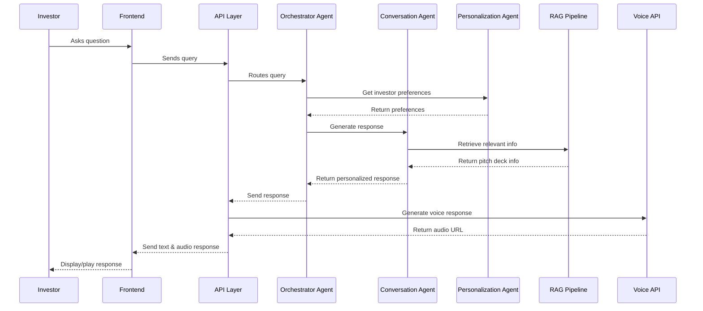
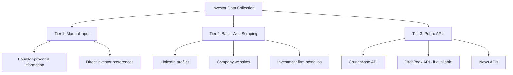
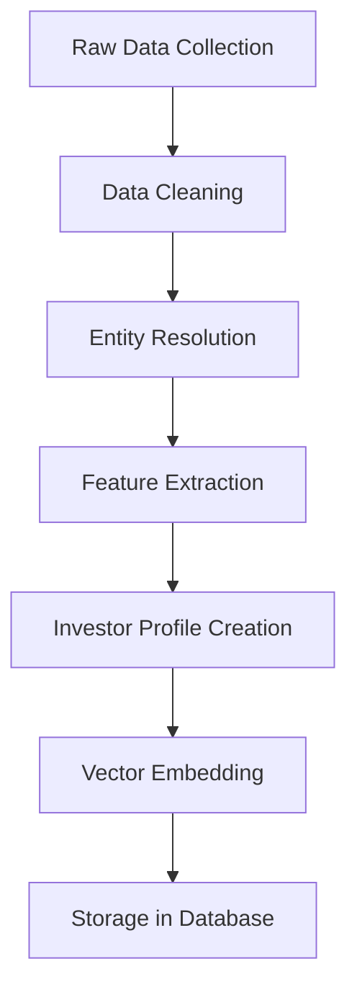
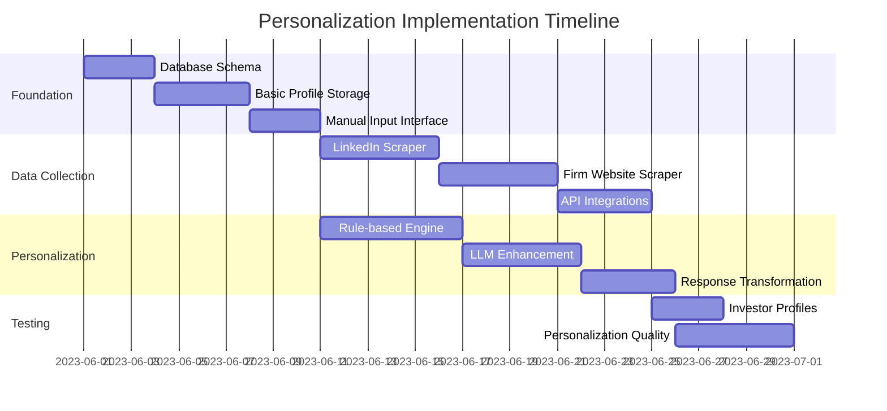
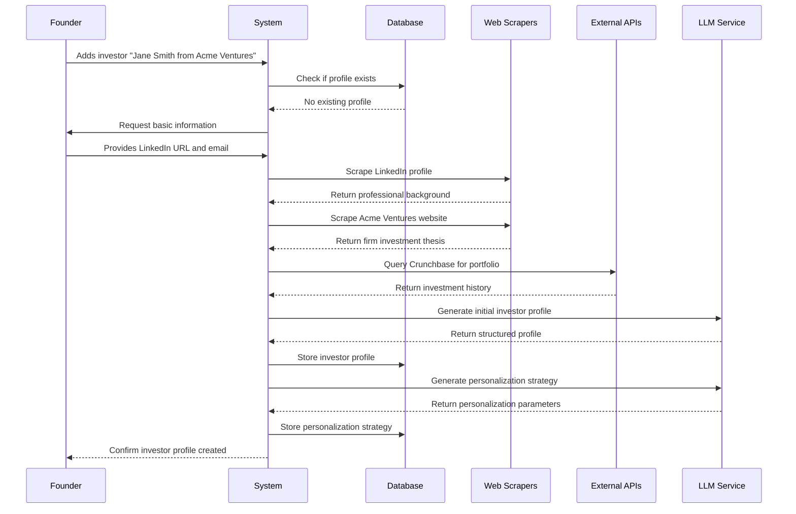

# PitchAgent Multi-Agent Backend Architecture Plan

## 1. System Overview

The PitchAgent multi-agent backend will be a Python-based system that coordinates multiple specialized agents to deliver personalized pitch experiences. The system will integrate with your existing frontend (Next.js/Papermark) and RAG pipeline, and will use OpenAI's API and LlamaIndex for various functionalities.

Here's a high-level overview of the architecture:



## 2. Core Components

### 2.1 Orchestrator Agent

The Orchestrator Agent will be the central coordinator of the multi-agent system, responsible for:

- Receiving and routing user queries
- Determining which specialized agent should handle each query
- Maintaining conversation context and state
- Coordinating responses between agents
- Managing the overall conversation flow

**Implementation Details:**
- Built using OpenAI's API with a system prompt that defines its role as coordinator
- Maintains a conversation memory to track context
- Uses a decision-making framework to route queries to appropriate agents

### 2.2 Conversation Agent

The Conversation Agent will handle direct interactions with investors, including:

- Answering questions about the pitch deck
- Providing detailed explanations of business aspects
- Handling follow-up questions
- Maintaining a natural, engaging conversation flow

**Implementation Details:**
- Leverages the existing RAG pipeline to retrieve relevant information from the pitch deck
- Uses OpenAI's API with appropriate prompting to generate conversational responses
- Maintains its own conversation memory for context
- Implements techniques to ensure responses align with the founder's messaging

### 2.3 Personalization Agent

The Personalization Agent will customize the pitch experience based on investor preferences:

- Storing and retrieving investor profiles
- Adjusting content emphasis based on investor interests
- Personalizing examples and analogies
- Adapting communication style to match investor preferences

**Implementation Details:**
- Uses a simple database to store investor profiles
- Implements basic web scraping for investor research (for MVP)
- Uses LlamaIndex to process and structure investor information
- Provides personalization parameters to other agents

### 2.4 Webhook Manager

The Webhook Manager will handle real-time communication with the frontend:

- Managing webhook connections
- Sending and receiving real-time updates
- Coordinating with voice/video APIs (Elevenlabs/Tavus)
- Handling state synchronization

**Implementation Details:**
- Implements webhook handlers using FastAPI
- Manages asynchronous communication
- Handles connection state and retries
- Provides a bridge between the multi-agent system and external APIs

## 3. Data Flow



## 4. Implementation Plan

### 4.1 Project Structure

```
pitchagent/
├── api/
│   ├── __init__.py
│   ├── main.py            # FastAPI application
│   ├── routes/
│   │   ├── __init__.py
│   │   ├── conversation.py # Conversation endpoints
│   │   └── webhooks.py     # Webhook handlers
│   └── utils/
│       ├── __init__.py
│       └── auth.py         # Authentication utilities
├── agents/
│   ├── __init__.py
│   ├── orchestrator.py     # Orchestrator agent
│   ├── conversation.py     # Conversation agent
│   ├── personalization.py  # Personalization agent
│   └── base.py             # Base agent class
├── models/
│   ├── __init__.py
│   ├── investor.py         # Investor model
│   ├── conversation.py     # Conversation model
│   └── pitch.py            # Pitch deck model
├── services/
│   ├── __init__.py
│   ├── llm.py              # LLM service
│   ├── rag.py              # RAG service
│   ├── voice.py            # Voice API service
│   └── scraper.py          # Basic web scraper
├── utils/
│   ├── __init__.py
│   ├── prompts.py          # Prompt templates
│   └── memory.py           # Conversation memory utilities
├── config.py               # Configuration
└── main.py                 # Application entry point
```

### 4.2 Development Phases

#### Phase 1: Core Infrastructure (Week 1)
- Set up project structure
- Implement API layer with FastAPI
- Create base agent class
- Implement LLM service with OpenAI API
- Set up basic webhook handling

#### Phase 2: Agent Implementation (Week 2)
- Implement Orchestrator Agent
- Implement Conversation Agent
- Integrate with existing RAG pipeline
- Implement basic conversation flow

#### Phase 3: Personalization (Week 3)
- Implement Personalization Agent
- Create investor database
- Implement basic web scraping for investor research
- Integrate personalization into conversation flow

#### Phase 4: Integration and Testing (Week 4)
- Integrate with voice API (Elevenlabs/Tavus)
- Implement webhook synchronization with frontend
- Comprehensive testing
- Performance optimization
- Documentation

## 5. Technical Specifications

### 5.1 API Endpoints

```
POST /api/conversation/start
- Start a new conversation session
- Requires: founder_id, pitch_id, investor_id (optional)
- Returns: conversation_id, initial_greeting

POST /api/conversation/message
- Send a message in an existing conversation
- Requires: conversation_id, message
- Returns: response, audio_url

GET /api/conversation/{conversation_id}
- Get conversation history
- Returns: messages[]

POST /api/webhooks/voice
- Webhook endpoint for voice API callbacks
- Handles: status updates, completed audio

POST /api/investor
- Create or update investor profile
- Requires: investor details
- Returns: investor_id
```

### 5.2 Agent Communication Protocol

Agents will communicate using a standardized message format:

```python
{
    "agent_id": "string",
    "message_type": "string",  # request, response, error
    "content": {},             # message content
    "metadata": {},            # additional information
    "timestamp": "datetime"
}
```

### 5.3 Personalization Parameters

The system will support the following personalization parameters:

- Communication style (formal, casual, technical)
- Content emphasis (product, market, team, financials)
- Detail level (high-level, detailed)
- Pace (quick, moderate, thorough)
- Special interests or focus areas

### 5.4 Technologies

- **Backend Framework**: FastAPI
- **LLM Provider**: OpenAI API
- **Vector Database**: Existing solution (from your RAG pipeline)
- **Voice API**: Elevenlabs (MVP), Tavus (future)
- **Data Processing**: LlamaIndex
- **Deployment**: To be determined based on your infrastructure

## 6. Integration with Existing Systems

### 6.1 Frontend Integration

The multi-agent backend will integrate with your Next.js/Papermark frontend through:

1. REST API endpoints for standard requests
2. Webhook-based communication for real-time updates
3. WebSocket connections for live conversation (if needed)

### 6.2 RAG Pipeline Integration

The system will leverage your existing RAG pipeline by:

1. Using the same vector database
2. Extending the query capabilities for agent-specific needs
3. Adding metadata to embeddings for better retrieval

### 6.3 Voice API Integration

The system will integrate with Elevenlabs (MVP) and later Tavus through:

1. API client implementation
2. Webhook handlers for asynchronous responses
3. Caching mechanisms for improved performance

## 7. Scalability and Future Expansion

While the MVP focuses on core functionality, the architecture is designed to be extensible:

1. **Additional Agents**: The system can easily incorporate new specialized agents
2. **Enhanced Personalization**: More sophisticated investor research and personalization
3. **Advanced Analytics**: Tracking conversation effectiveness and investor engagement
4. **Multi-modal Capabilities**: Expanding to include visual elements beyond voice

## 8. Challenges and Mitigations

### 8.1 Webhook Integration with Papermark

**Challenge**: Integrating webhook-based real-time communication with the Papermark UI.

**Mitigation**:
- Implement a lightweight adapter layer in the frontend
- Use a polling fallback mechanism if webhooks prove challenging
- Consider a phased approach to real-time features

### 8.2 Agent Coordination

**Challenge**: Ensuring smooth coordination between multiple agents.

**Mitigation**:
- Implement robust state management in the Orchestrator
- Use clear communication protocols between agents
- Implement comprehensive logging for debugging

### 8.3 Personalization Quality

**Challenge**: Achieving meaningful personalization with limited investor data.

**Mitigation**:
- Start with basic personalization parameters
- Implement feedback mechanisms to improve over time
- Use default strategies when specific data is unavailable

## 9. Success Metrics

To evaluate the success of the MVP, consider tracking:

1. **Conversation Quality**: Coherence, relevance, and naturalness of responses
2. **Personalization Effectiveness**: How well the system adapts to different investors
3. **Technical Performance**: Response times, error rates, and system stability
4. **User Satisfaction**: Feedback from both founders and investors


I'll expand on the personalization capabilities and how we'll gather and use investor information in the MVP. Here's a more detailed breakdown:

# Enhanced Personalization Capabilities for PitchAgent MVP

## 1. Investor Data Collection

### 1.1 Data Sources

For the MVP, we'll implement a tiered approach to investor data collection:



#### Tier 1: Manual Input
- **Founder-provided information**: Allow founders to input what they know about investors
- **Direct investor preferences**: If available, use preferences directly specified by investors
- **Implementation**: Simple form interfaces and database storage

#### Tier 2: Basic Web Scraping
For the MVP, we'll implement lightweight scrapers for:
- **LinkedIn profiles**: Extract professional background, interests, and recent activity
- **Investment firm websites**: Gather investment thesis, portfolio companies, and focus areas
- **Portfolio analysis**: Identify patterns in previous investments

```python
# Example scraper implementation (simplified)
class LinkedInScraper:
    def __init__(self, proxy_config=None):
        self.session = self._create_session(proxy_config)
        
    def scrape_investor_profile(self, profile_url):
        """Scrape basic information from LinkedIn profile."""
        try:
            response = self.session.get(profile_url)
            soup = BeautifulSoup(response.content, 'html.parser')
            
            data = {
                'name': self._extract_name(soup),
                'headline': self._extract_headline(soup),
                'about': self._extract_about(soup),
                'experience': self._extract_experience(soup),
                'education': self._extract_education(soup),
                'interests': self._extract_interests(soup),
                'recent_activity': self._extract_activity(soup)
            }
            
            return data
        except Exception as e:
            logger.error(f"Error scraping LinkedIn profile: {e}")
            return None
```

#### Tier 3: Public APIs
If budget allows, integrate with:
- **Crunchbase API**: For comprehensive investment data
- **PitchBook API**: For detailed investor profiles (if available)
- **News APIs**: To gather recent mentions and activities

### 1.2 Data Processing Pipeline



1. **Data Cleaning**: Normalize formats, remove duplicates, handle missing values
2. **Entity Resolution**: Match data from different sources to the same investor
3. **Feature Extraction**: Extract relevant attributes for personalization
4. **Investor Profile Creation**: Create structured profiles
5. **Vector Embedding**: Generate embeddings for semantic matching
6. **Storage**: Store in both structured database and vector database

## 2. Investor Profile Schema

For the MVP, we'll implement a comprehensive investor profile schema:

```python
class InvestorProfile:
    def __init__(self):
        # Basic information
        self.id = None
        self.name = None
        self.firm = None
        self.position = None
        self.contact_info = {}
        
        # Investment preferences
        self.investment_stages = []  # seed, series A, etc.
        self.investment_sizes = []   # ranges
        self.sectors = []            # fintech, healthtech, etc.
        self.geographies = []        # regions of interest
        
        # Previous investments
        self.portfolio = []          # companies invested in
        self.successful_exits = []   # successful portfolio companies
        
        # Communication preferences
        self.communication_style = None  # formal, casual, technical
        self.detail_level = None         # high-level, detailed
        self.known_interests = []        # personal/professional interests
        
        # Derived attributes (calculated)
        self.risk_profile = None         # conservative, moderate, aggressive
        self.decision_factors = {}       # weighted importance of different factors
        self.personality_traits = {}     # derived personality characteristics
        
        # Metadata
        self.data_sources = []           # sources of this information
        self.confidence_scores = {}      # confidence in different attributes
        self.last_updated = None         # timestamp
```

## 3. Personalization Engine

### 3.1 Personalization Parameters

The MVP will focus on these key personalization dimensions:

1. **Content Emphasis**
   - Which aspects of the pitch to emphasize (product, market, team, financials)
   - Based on investor's previous investments and stated preferences
   
2. **Communication Style**
   - Formal vs. casual
   - Technical vs. non-technical
   - Direct vs. storytelling approach
   
3. **Detail Level**
   - High-level overview vs. detailed explanations
   - Data-driven vs. vision-driven
   
4. **Pace and Structure**
   - Quick highlights vs. comprehensive walkthrough
   - Linear vs. non-linear presentation
   
5. **Examples and Analogies**
   - Industry-specific examples
   - References to portfolio companies
   - Analogies based on known interests

### 3.2 Personalization Agent Implementation

The Personalization Agent will use a combination of rule-based and ML-based approaches:

```python
class PersonalizationAgent(BaseAgent):
    def __init__(self, config):
        super().__init__(config)
        self.investor_db = InvestorDatabase()
        self.llm_service = LLMService()
        self.scraper_service = ScraperService()
        
    async def get_investor_profile(self, investor_id):
        """Retrieve or create investor profile."""
        profile = await self.investor_db.get_profile(investor_id)
        
        if not profile or profile.needs_update():
            # Gather new information
            await self.update_investor_profile(investor_id)
            profile = await self.investor_db.get_profile(investor_id)
            
        return profile
    
    async def update_investor_profile(self, investor_id):
        """Update investor profile with latest information."""
        basic_info = await self.investor_db.get_basic_info(investor_id)
        
        # Tier 1: Use existing information
        
        # Tier 2: Web scraping if we have URLs
        if basic_info.linkedin_url:
            linkedin_data = await self.scraper_service.scrape_linkedin(
                basic_info.linkedin_url
            )
            await self.investor_db.update_from_linkedin(investor_id, linkedin_data)
            
        if basic_info.firm_website:
            firm_data = await self.scraper_service.scrape_firm_website(
                basic_info.firm_website
            )
            await self.investor_db.update_from_firm_data(investor_id, firm_data)
        
        # Tier 3: API calls if available
        if self.config.use_crunchbase_api and basic_info.crunchbase_id:
            crunchbase_data = await self.scraper_service.get_crunchbase_data(
                basic_info.crunchbase_id
            )
            await self.investor_db.update_from_crunchbase(investor_id, crunchbase_data)
    
    async def generate_personalization_params(self, investor_id, pitch_id):
        """Generate personalization parameters for a specific pitch."""
        investor = await self.get_investor_profile(investor_id)
        pitch = await self.pitch_db.get_pitch(pitch_id)
        
        # Rule-based personalization
        params = self._apply_basic_rules(investor, pitch)
        
        # LLM-enhanced personalization
        enhanced_params = await self._enhance_with_llm(investor, pitch, params)
        
        return enhanced_params
    
    def _apply_basic_rules(self, investor, pitch):
        """Apply basic rule-based personalization."""
        params = PersonalizationParams()
        
        # Set content emphasis based on investor sectors
        params.content_emphasis = self._determine_content_emphasis(
            investor.sectors, 
            investor.decision_factors
        )
        
        # Set communication style
        params.communication_style = investor.communication_style or "balanced"
        
        # Set detail level based on position and previous preferences
        params.detail_level = self._determine_detail_level(
            investor.position,
            investor.detail_level
        )
        
        # Set pace based on derived personality traits
        params.pace = investor.personality_traits.get("patience", "moderate")
        
        return params
    
    async def _enhance_with_llm(self, investor, pitch, base_params):
        """Enhance personalization using LLM."""
        # Prepare context for LLM
        context = self._prepare_llm_context(investor, pitch, base_params)
        
        # Generate enhanced personalization
        response = await self.llm_service.complete(
            prompt=PERSONALIZATION_PROMPT,
            context=context
        )
        
        # Parse and validate LLM suggestions
        enhanced_params = self._parse_llm_suggestions(response, base_params)
        
        return enhanced_params
    
    async def personalize_response(self, response, personalization_params):
        """Apply personalization to a response."""
        # Apply personalization transformations
        personalized = await self.llm_service.complete(
            prompt=PERSONALIZE_RESPONSE_PROMPT,
            context={
                "original_response": response,
                "params": personalization_params
            }
        )
        
        return personalized
```

### 3.3 Example Personalization Prompt

```
You are personalizing a pitch response for an investor. 
Apply the following personalization parameters to transform the original response:

Content Emphasis: {params.content_emphasis}
Communication Style: {params.communication_style}
Detail Level: {params.detail_level}
Pace: {params.pace}

The investor has previously invested in: {investor.portfolio}
The investor's known interests include: {investor.known_interests}

Original response:
{original_response}

Provide a personalized version that:
1. Emphasizes the aspects most relevant to this investor
2. Uses the appropriate communication style
3. Provides the right level of detail
4. Maintains the core information while adjusting presentation
5. References relevant examples from their portfolio when appropriate

Personalized response:
```

## 4. Implementation Strategy for MVP

### 4.1 Phased Approach to Personalization



### 4.2 MVP Limitations and Future Enhancements

For transparency, the MVP will have these limitations:

1. **Data Freshness**: Initial profiles may contain outdated information
2. **Coverage**: Not all investors will have comprehensive profiles
3. **Personalization Depth**: Initial personalization will focus on broader categories
4. **Confidence Scoring**: Limited ability to assess confidence in derived attributes

Future enhancements beyond MVP:
1. **Continuous Learning**: Improve personalization based on interaction feedback
2. **Advanced NLP**: More sophisticated analysis of investor communications
3. **Expanded Data Sources**: Integration with more specialized databases
4. **Collaborative Filtering**: Recommendations based on similar investors
5. **Multi-modal Personalization**: Extend to visual and interactive elements

### 4.3 Measuring Personalization Effectiveness

To evaluate the effectiveness of personalization:

1. **A/B Testing**: Compare personalized vs. non-personalized responses
2. **Engagement Metrics**: Track investor interaction patterns
3. **Feedback Collection**: Gather explicit feedback from founders and investors
4. **Conversion Tracking**: Monitor progression from pitch to follow-up meetings

## 5. Example Investor Research Flow

Here's how the system would research an investor in practice:



## 6. Integration with Orchestrator and Conversation Agents

The Personalization Agent will integrate with other agents as follows:

### 6.1 Orchestrator Integration

```python
# In orchestrator.py
async def handle_query(self, query, conversation_id):
    """Handle incoming query from investor."""
    # Get conversation context
    conversation = await self.conversation_db.get_conversation(conversation_id)
    investor_id = conversation.investor_id
    pitch_id = conversation.pitch_id
    
    # Get personalization parameters
    personalization_params = await self.personalization_agent.generate_personalization_params(
        investor_id, pitch_id
    )
    
    # Route to appropriate agent
    if self._is_product_question(query):
        response = await self.product_agent.handle_query(
            query, conversation.context
        )
    elif self._is_financial_question(query):
        response = await self.financial_agent.handle_query(
            query, conversation.context
        )
    else:
        response = await self.conversation_agent.handle_query(
            query, conversation.context
        )
    
    # Apply personalization
    personalized_response = await self.personalization_agent.personalize_response(
        response, personalization_params
    )
    
    return personalized_response
```

### 6.2 Conversation Agent Integration

```python
# In conversation_agent.py
async def prepare_response(self, query, response, investor_id):
    """Prepare final response with personalization."""
    # Get investor profile
    investor = await self.personalization_agent.get_investor_profile(investor_id)
    
    # Adjust response based on investor preferences
    if investor.detail_level == "high":
        response = await self._add_additional_details(response)
    elif investor.detail_level == "low":
        response = await self._simplify_response(response)
    
    # Add relevant examples
    if investor.portfolio:
        response = await self._add_relevant_examples(response, investor.portfolio)
    
    # Adjust tone and style
    response = await self._adjust_communication_style(
        response, investor.communication_style
    )
    
    return response
```
