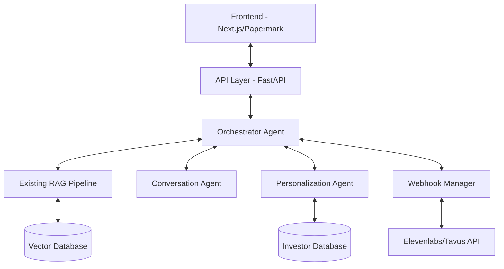
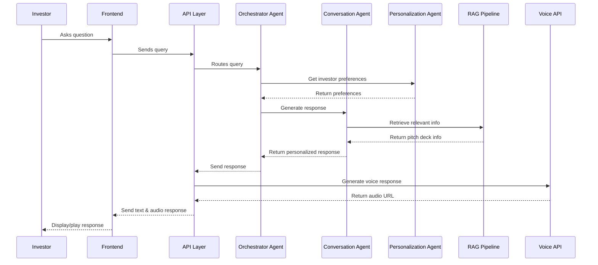
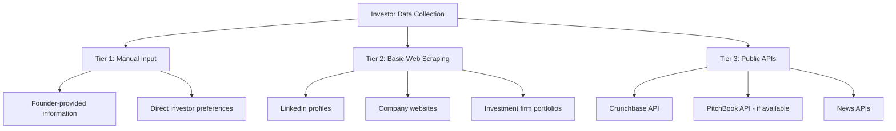
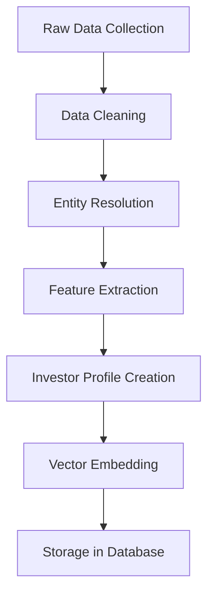
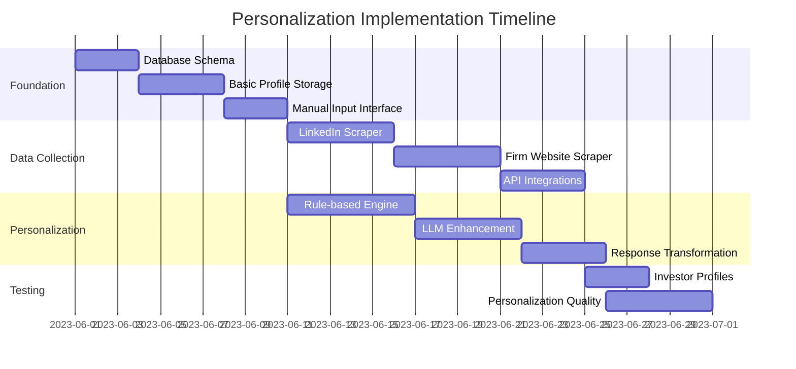
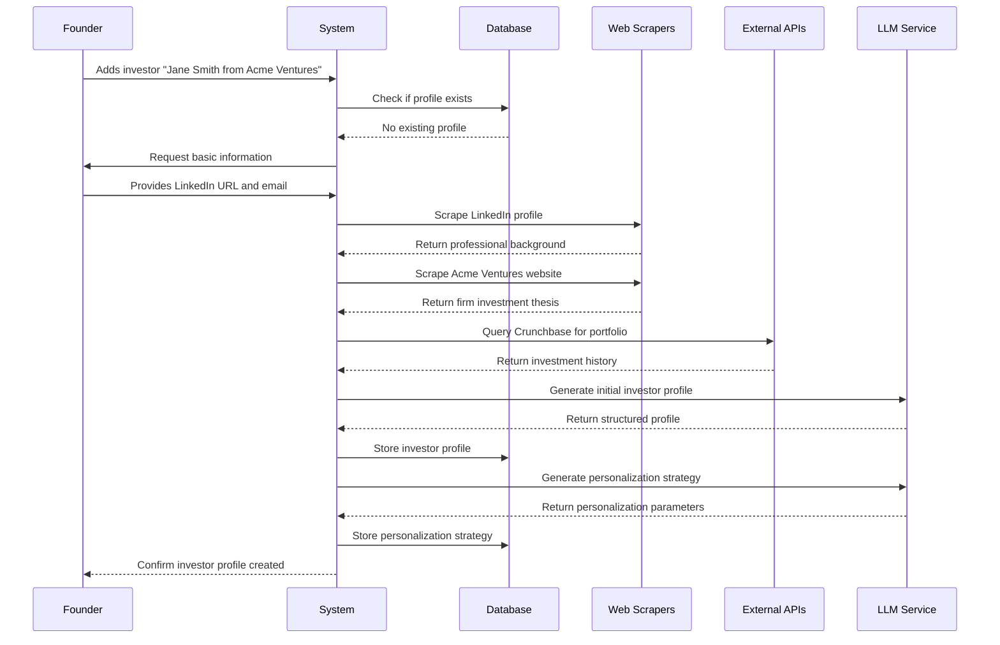

# PitchAgent Multi-Agent Backend Architecture Plan

## 1. System Overview

The PitchAgent multi-agent backend will be a Python-based system that coordinates multiple specialized agents to deliver personalized pitch experiences. The system will integrate with your existing frontend (Next.js/Papermark) and RAG pipeline, and will use OpenAI's API and LlamaIndex for various functionalities.

Here's a high-level overview of the architecture:



## 2. Core Components

### 2.1 Orchestrator Agent

The Orchestrator Agent will be the central coordinator of the multi-agent system, responsible for:

- Receiving and routing user queries
- Determining which specialized agent should handle each query
- Maintaining conversation context and state
- Coordinating responses between agents
- Managing the overall conversation flow

**Implementation Details:**
- Built using OpenAI's API with a system prompt that defines its role as coordinator
- Maintains a conversation memory to track context
- Uses a decision-making framework to route queries to appropriate agents

### 2.2 Conversation Agent

The Conversation Agent will handle direct interactions with investors, including:

- Answering questions about the pitch deck
- Providing detailed explanations of business aspects
- Handling follow-up questions
- Maintaining a natural, engaging conversation flow

**Implementation Details:**
- Leverages the existing RAG pipeline to retrieve relevant information from the pitch deck
- Uses OpenAI's API with appropriate prompting to generate conversational responses
- Maintains its own conversation memory for context
- Implements techniques to ensure responses align with the founder's messaging

### 2.3 Personalization Agent

The Personalization Agent will customize the pitch experience based on investor preferences:

- Storing and retrieving investor profiles
- Adjusting content emphasis based on investor interests
- Personalizing examples and analogies
- Adapting communication style to match investor preferences

**Implementation Details:**
- Uses a simple database to store investor profiles
- Implements basic web scraping for investor research (for MVP)
- Uses LlamaIndex to process and structure investor information
- Provides personalization parameters to other agents

### 2.4 Webhook Manager

The Webhook Manager will handle real-time communication with the frontend:

- Managing webhook connections
- Sending and receiving real-time updates
- Coordinating with voice/video APIs (Elevenlabs/Tavus)
- Handling state synchronization

**Implementation Details:**
- Implements webhook handlers using FastAPI
- Manages asynchronous communication
- Handles connection state and retries
- Provides a bridge between the multi-agent system and external APIs

## 3. Data Flow



## 4. Implementation Plan

### 4.1 Project Structure

```
pitchagent/
├── api/
│   ├── __init__.py
│   ├── main.py            # FastAPI application
│   ├── routes/
│   │   ├── __init__.py
│   │   ├── conversation.py # Conversation endpoints
│   │   └── webhooks.py     # Webhook handlers
│   └── utils/
│       ├── __init__.py
│       └── auth.py         # Authentication utilities
├── agents/
│   ├── __init__.py
│   ├── orchestrator.py     # Orchestrator agent
│   ├── conversation.py     # Conversation agent
│   ├── personalization.py  # Personalization agent
│   └── base.py             # Base agent class
├── models/
│   ├── __init__.py
│   ├── investor.py         # Investor model
│   ├── conversation.py     # Conversation model
│   └── pitch.py            # Pitch deck model
├── services/
│   ├── __init__.py
│   ├── llm.py              # LLM service
│   ├── rag.py              # RAG service
│   ├── voice.py            # Voice API service
│   └── scraper.py          # Basic web scraper
├── utils/
│   ├── __init__.py
│   ├── prompts.py          # Prompt templates
│   └── memory.py           # Conversation memory utilities
├── config.py               # Configuration
└── main.py                 # Application entry point
```

### 4.2 Development Phases

#### Phase 1: Core Infrastructure 
- Set up project structure
- Implement API layer with FastAPI
- Create base agent class
- Implement LLM service with OpenAI API
- Set up basic webhook handling

#### Phase 2: Agent Implementation 
- Implement Orchestrator Agent
- Implement Conversation Agent
- Integrate with existing RAG pipeline
- Implement basic conversation flow

#### Phase 3: Personalization 
- Implement Personalization Agent
- Create investor database
- Implement basic web scraping for investor research
- Integrate personalization into conversation flow

#### Phase 4: Integration and Testing 
- Integrate with voice API (Elevenlabs/Tavus)
- Implement webhook synchronization with frontend
- Comprehensive testing
- Performance optimization
- Documentation

## 5. Technical Specifications

### 5.1 API Endpoints

```
POST /api/conversation/start
- Start a new conversation session
- Requires: founder_id, pitch_id, investor_id (optional)
- Returns: conversation_id, initial_greeting

POST /api/conversation/message
- Send a message in an existing conversation
- Requires: conversation_id, message
- Returns: response, audio_url

GET /api/conversation/{conversation_id}
- Get conversation history
- Returns: messages[]

POST /api/webhooks/voice
- Webhook endpoint for voice API callbacks
- Handles: status updates, completed audio

POST /api/investor
- Create or update investor profile
- Requires: investor details
- Returns: investor_id
```

### 5.2 Agent Communication Protocol

Agents will communicate using a standardized message format:

```python
{
    "agent_id": "string",
    "message_type": "string",  # request, response, error
    "content": {},             # message content
    "metadata": {},            # additional information
    "timestamp": "datetime"
}
```

### 5.3 Personalization Parameters

The system will support the following personalization parameters:

- Communication style (formal, casual, technical)
- Content emphasis (product, market, team, financials)
- Detail level (high-level, detailed)
- Pace (quick, moderate, thorough)
- Special interests or focus areas

### 5.4 Technologies

- **Backend Framework**: FastAPI
- **LLM Provider**: OpenAI API
- **Vector Database**: Existing solution (from your RAG pipeline)
- **Voice API**: Elevenlabs (MVP), Tavus (future)
- **Data Processing**: LlamaIndex
- **Deployment**: To be determined based on your infrastructure

## 6. Integration with Existing Systems

### 6.1 Frontend Integration

The multi-agent backend will integrate with your Next.js/Papermark frontend through:

1. REST API endpoints for standard requests
2. Webhook-based communication for real-time updates
3. WebSocket connections for live conversation (if needed)

### 6.2 RAG Pipeline Integration

The system will leverage your existing RAG pipeline by:

1. Using the same vector database
2. Extending the query capabilities for agent-specific needs
3. Adding metadata to embeddings for better retrieval

### 6.3 Voice API Integration

The system will integrate with Elevenlabs (MVP) and later Tavus through:

1. API client implementation
2. Webhook handlers for asynchronous responses
3. Caching mechanisms for improved performance

## 7. Scalability and Future Expansion

While the MVP focuses on core functionality, the architecture is designed to be extensible:

1. **Additional Agents**: The system can easily incorporate new specialized agents
2. **Enhanced Personalization**: More sophisticated investor research and personalization
3. **Advanced Analytics**: Tracking conversation effectiveness and investor engagement
4. **Multi-modal Capabilities**: Expanding to include visual elements beyond voice

## 8. Challenges and Mitigations

### 8.1 Webhook Integration with Papermark

**Challenge**: Integrating webhook-based real-time communication with the Papermark UI.

**Mitigation**:
- Implement a lightweight adapter layer in the frontend
- Use a polling fallback mechanism if webhooks prove challenging
- Consider a phased approach to real-time features

### 8.2 Agent Coordination

**Challenge**: Ensuring smooth coordination between multiple agents.

**Mitigation**:
- Implement robust state management in the Orchestrator
- Use clear communication protocols between agents
- Implement comprehensive logging for debugging

### 8.3 Personalization Quality

**Challenge**: Achieving meaningful personalization with limited investor data.

**Mitigation**:
- Start with basic personalization parameters
- Implement feedback mechanisms to improve over time
- Use default strategies when specific data is unavailable


I'll expand on the personalization capabilities and how we'll gather and use investor information in the MVP. Here's a more detailed breakdown:

# Enhanced Personalization Capabilities for PitchAgent MVP

## 1. Investor Data Collection

### 1.1 Data Sources

For the MVP, we'll implement a tiered approach to investor data collection:



#### Tier 1: Manual Input
- **Founder-provided information**: Allow founders to input what they know about investors
- **Direct investor preferences**: If available, use preferences directly specified by investors
- **Implementation**: Simple form interfaces and database storage

#### Tier 2: Basic Web Scraping
For the MVP, we'll implement lightweight scrapers for:
- **LinkedIn profiles**: Extract professional background, interests, and recent activity
- **Investment firm websites**: Gather investment thesis, portfolio companies, and focus areas
- **Portfolio analysis**: Identify patterns in previous investments

```python
# Example scraper implementation (simplified)
class LinkedInScraper:
    def __init__(self, proxy_config=None):
        self.session = self._create_session(proxy_config)
        
    def scrape_investor_profile(self, profile_url):
        """Scrape basic information from LinkedIn profile."""
        try:
            response = self.session.get(profile_url)
            soup = BeautifulSoup(response.content, 'html.parser')
            
            data = {
                'name': self._extract_name(soup),
                'headline': self._extract_headline(soup),
                'about': self._extract_about(soup),
                'experience': self._extract_experience(soup),
                'education': self._extract_education(soup),
                'interests': self._extract_interests(soup),
                'recent_activity': self._extract_activity(soup)
            }
            
            return data
        except Exception as e:
            logger.error(f"Error scraping LinkedIn profile: {e}")
            return None
```

#### Tier 3: Public APIs
If budget allows, integrate with:
- **Crunchbase API**: For comprehensive investment data
- **PitchBook API**: For detailed investor profiles (if available)
- **News APIs**: To gather recent mentions and activities

### 1.2 Data Processing Pipeline



1. **Data Cleaning**: Normalize formats, remove duplicates, handle missing values
2. **Entity Resolution**: Match data from different sources to the same investor
3. **Feature Extraction**: Extract relevant attributes for personalization
4. **Investor Profile Creation**: Create structured profiles
5. **Vector Embedding**: Generate embeddings for semantic matching
6. **Storage**: Store in both structured database and vector database

## 2. Investor Profile Schema

For the MVP, we'll implement a comprehensive investor profile schema:

```python
class InvestorProfile:
    def __init__(self):
        # Basic information
        self.id = None
        self.name = None
        self.firm = None
        self.position = None
        self.contact_info = {}
        
        # Investment preferences
        self.investment_stages = []  # seed, series A, etc.
        self.investment_sizes = []   # ranges
        self.sectors = []            # fintech, healthtech, etc.
        self.geographies = []        # regions of interest
        
        # Previous investments
        self.portfolio = []          # companies invested in
        self.successful_exits = []   # successful portfolio companies
        
        # Communication preferences
        self.communication_style = None  # formal, casual, technical
        self.detail_level = None         # high-level, detailed
        self.known_interests = []        # personal/professional interests
        
        # Derived attributes (calculated)
        self.risk_profile = None         # conservative, moderate, aggressive
        self.decision_factors = {}       # weighted importance of different factors
        self.personality_traits = {}     # derived personality characteristics
        
        # Metadata
        self.data_sources = []           # sources of this information
        self.confidence_scores = {}      # confidence in different attributes
        self.last_updated = None         # timestamp
```

## 3. Personalization Engine

### 3.1 Personalization Parameters

The MVP will focus on these key personalization dimensions:

1. **Content Emphasis**
   - Which aspects of the pitch to emphasize (product, market, team, financials)
   - Based on investor's previous investments and stated preferences
   
2. **Communication Style**
   - Formal vs. casual
   - Technical vs. non-technical
   - Direct vs. storytelling approach
   
3. **Detail Level**
   - High-level overview vs. detailed explanations
   - Data-driven vs. vision-driven
   
4. **Pace and Structure**
   - Quick highlights vs. comprehensive walkthrough
   - Linear vs. non-linear presentation
   
5. **Examples and Analogies**
   - Industry-specific examples
   - References to portfolio companies
   - Analogies based on known interests

### 3.2 Personalization Agent Implementation

The Personalization Agent will use a combination of rule-based and ML-based approaches:

```python
class PersonalizationAgent(BaseAgent):
    def __init__(self, config):
        super().__init__(config)
        self.investor_db = InvestorDatabase()
        self.llm_service = LLMService()
        self.scraper_service = ScraperService()
        
    async def get_investor_profile(self, investor_id):
        """Retrieve or create investor profile."""
        profile = await self.investor_db.get_profile(investor_id)
        
        if not profile or profile.needs_update():
            # Gather new information
            await self.update_investor_profile(investor_id)
            profile = await self.investor_db.get_profile(investor_id)
            
        return profile
    
    async def update_investor_profile(self, investor_id):
        """Update investor profile with latest information."""
        basic_info = await self.investor_db.get_basic_info(investor_id)
        
        # Tier 1: Use existing information
        
        # Tier 2: Web scraping if we have URLs
        if basic_info.linkedin_url:
            linkedin_data = await self.scraper_service.scrape_linkedin(
                basic_info.linkedin_url
            )
            await self.investor_db.update_from_linkedin(investor_id, linkedin_data)
            
        if basic_info.firm_website:
            firm_data = await self.scraper_service.scrape_firm_website(
                basic_info.firm_website
            )
            await self.investor_db.update_from_firm_data(investor_id, firm_data)
        
        # Tier 3: API calls if available
        if self.config.use_crunchbase_api and basic_info.crunchbase_id:
            crunchbase_data = await self.scraper_service.get_crunchbase_data(
                basic_info.crunchbase_id
            )
            await self.investor_db.update_from_crunchbase(investor_id, crunchbase_data)
    
    async def generate_personalization_params(self, investor_id, pitch_id):
        """Generate personalization parameters for a specific pitch."""
        investor = await self.get_investor_profile(investor_id)
        pitch = await self.pitch_db.get_pitch(pitch_id)
        
        # Rule-based personalization
        params = self._apply_basic_rules(investor, pitch)
        
        # LLM-enhanced personalization
        enhanced_params = await self._enhance_with_llm(investor, pitch, params)
        
        return enhanced_params
    
    def _apply_basic_rules(self, investor, pitch):
        """Apply basic rule-based personalization."""
        params = PersonalizationParams()
        
        # Set content emphasis based on investor sectors
        params.content_emphasis = self._determine_content_emphasis(
            investor.sectors, 
            investor.decision_factors
        )
        
        # Set communication style
        params.communication_style = investor.communication_style or "balanced"
        
        # Set detail level based on position and previous preferences
        params.detail_level = self._determine_detail_level(
            investor.position,
            investor.detail_level
        )
        
        # Set pace based on derived personality traits
        params.pace = investor.personality_traits.get("patience", "moderate")
        
        return params
    
    async def _enhance_with_llm(self, investor, pitch, base_params):
        """Enhance personalization using LLM."""
        # Prepare context for LLM
        context = self._prepare_llm_context(investor, pitch, base_params)
        
        # Generate enhanced personalization
        response = await self.llm_service.complete(
            prompt=PERSONALIZATION_PROMPT,
            context=context
        )
        
        # Parse and validate LLM suggestions
        enhanced_params = self._parse_llm_suggestions(response, base_params)
        
        return enhanced_params
    
    async def personalize_response(self, response, personalization_params):
        """Apply personalization to a response."""
        # Apply personalization transformations
        personalized = await self.llm_service.complete(
            prompt=PERSONALIZE_RESPONSE_PROMPT,
            context={
                "original_response": response,
                "params": personalization_params
            }
        )
        
        return personalized
```

### 3.3 Example Personalization Prompt

```
You are personalizing a pitch response for an investor. 
Apply the following personalization parameters to transform the original response:

Content Emphasis: {params.content_emphasis}
Communication Style: {params.communication_style}
Detail Level: {params.detail_level}
Pace: {params.pace}

The investor has previously invested in: {investor.portfolio}
The investor's known interests include: {investor.known_interests}

Original response:
{original_response}

Provide a personalized version that:
1. Emphasizes the aspects most relevant to this investor
2. Uses the appropriate communication style
3. Provides the right level of detail
4. Maintains the core information while adjusting presentation
5. References relevant examples from their portfolio when appropriate

Personalized response:
```

## 4. Implementation Strategy for MVP

### 4.1 Phased Approach to Personalization



### 4.2 MVP Limitations and Future Enhancements

For transparency, the MVP will have these limitations:

1. **Data Freshness**: Initial profiles may contain outdated information
2. **Coverage**: Not all investors will have comprehensive profiles
3. **Personalization Depth**: Initial personalization will focus on broader categories
4. **Confidence Scoring**: Limited ability to assess confidence in derived attributes

Future enhancements beyond MVP:
1. **Continuous Learning**: Improve personalization based on interaction feedback
2. **Advanced NLP**: More sophisticated analysis of investor communications
3. **Expanded Data Sources**: Integration with more specialized databases
4. **Collaborative Filtering**: Recommendations based on similar investors
5. **Multi-modal Personalization**: Extend to visual and interactive elements

### 4.3 Measuring Personalization Effectiveness

To evaluate the effectiveness of personalization:

1. **A/B Testing**: Compare personalized vs. non-personalized responses
2. **Engagement Metrics**: Track investor interaction patterns
3. **Feedback Collection**: Gather explicit feedback from founders and investors
4. **Conversion Tracking**: Monitor progression from pitch to follow-up meetings

## 5. Example Investor Research Flow

Here's how the system would research an investor in practice:



## 6. Integration with Orchestrator and Conversation Agents

The Personalization Agent will integrate with other agents as follows:

### 6.1 Orchestrator Integration

```python
# In orchestrator.py
async def handle_query(self, query, conversation_id):
    """Handle incoming query from investor."""
    # Get conversation context
    conversation = await self.conversation_db.get_conversation(conversation_id)
    investor_id = conversation.investor_id
    pitch_id = conversation.pitch_id
    
    # Get personalization parameters
    personalization_params = await self.personalization_agent.generate_personalization_params(
        investor_id, pitch_id
    )
    
    # Route to appropriate agent
    if self._is_product_question(query):
        response = await self.product_agent.handle_query(
            query, conversation.context
        )
    elif self._is_financial_question(query):
        response = await self.financial_agent.handle_query(
            query, conversation.context
        )
    else:
        response = await self.conversation_agent.handle_query(
            query, conversation.context
        )
    
    # Apply personalization
    personalized_response = await self.personalization_agent.personalize_response(
        response, personalization_params
    )
    
    return personalized_response
```

### 6.2 Conversation Agent Integration

```python
# In conversation_agent.py
async def prepare_response(self, query, response, investor_id):
    """Prepare final response with personalization."""
    # Get investor profile
    investor = await self.personalization_agent.get_investor_profile(investor_id)
    
    # Adjust response based on investor preferences
    if investor.detail_level == "high":
        response = await self._add_additional_details(response)
    elif investor.detail_level == "low":
        response = await self._simplify_response(response)
    
    # Add relevant examples
    if investor.portfolio:
        response = await self._add_relevant_examples(response, investor.portfolio)
    
    # Adjust tone and style
    response = await self._adjust_communication_style(
        response, investor.communication_style
    )
    
    return response
```


# Existing Solutions for PitchAgent Multi-Agent Backend

This document provides a comprehensive overview of existing solutions and frameworks that could be leveraged for building the PitchAgent multi-agent backend. Rather than building everything from scratch, integrating these established tools can accelerate development and provide robust functionality.

## Table of Contents
- [Multi-Agent Frameworks](#multi-agent-frameworks)
- [RAG (Retrieval-Augmented Generation) Solutions](#rag-retrieval-augmented-generation-solutions)
- [Orchestration Tools](#orchestration-tools)
- [Personalization and Investor Research Tools](#personalization-and-investor-research-tools)
- [Voice and Conversation APIs](#voice-and-conversation-apis)
- [Web Scraping and Data Collection](#web-scraping-and-data-collection)
- [Integration and Deployment Solutions](#integration-and-deployment-solutions)
- [Comparison and Recommendations](#comparison-and-recommendations)

## Multi-Agent Frameworks

### 1. LangChain Agents
**Description**: LangChain provides a comprehensive framework for building agent-based systems with LLMs.
**Key Features**:
- Agent types (ReAct, Plan-and-Execute, etc.)
- Tool integration
- Memory management
- Conversation chains
- Structured outputs

**Pros**:
- Well-documented and actively maintained
- Large community and extensive examples
- Flexible architecture
- Python and TypeScript support

**Cons**:
- Can be complex for simple use cases
- Some performance overhead

**Relevance to PitchAgent**: Excellent foundation for building the orchestrator and specialized agents with standardized communication protocols.

**Documentation**: [LangChain Agents](https://python.langchain.com/docs/modules/agents/)

### 2. AutoGen
**Description**: Microsoft's framework for building multi-agent systems that can collaborate to solve tasks.
**Key Features**:
- Agent conversations
- Human-in-the-loop capabilities
- Customizable agent behaviors
- Group chat for multiple agents

**Pros**:
- Designed specifically for multi-agent collaboration
- Strong research backing from Microsoft
- Good for complex reasoning tasks

**Cons**:
- Less mature than LangChain
- Smaller community

**Relevance to PitchAgent**: Could be used for implementing the communication between different specialized agents.

**Documentation**: [AutoGen](https://microsoft.github.io/autogen/)

### 3. CrewAI
**Description**: Framework designed specifically for orchestrating role-playing agents to solve tasks.
**Key Features**:
- Role-based agent design
- Process management
- Task delegation
- Hierarchical agent structures

**Pros**:
- Purpose-built for role-based agents
- Intuitive API for agent collaboration
- Good for complex workflows

**Cons**:
- Newer project with less community support
- Limited integration options compared to LangChain

**Relevance to PitchAgent**: Well-suited for implementing the role-based structure (orchestrator, conversation agent, personalization agent).

**Documentation**: [CrewAI](https://github.com/crewai/crewai)

### 4. LlamaIndex Agent Framework
**Description**: LlamaIndex's agent framework designed to work seamlessly with their RAG capabilities.
**Key Features**:
- Tool integration
- Query planning
- Function calling
- RAG integration

**Pros**:
- Tight integration with LlamaIndex RAG
- Optimized for knowledge-intensive applications
- Good documentation

**Cons**:
- More focused on RAG than general agent capabilities
- Less flexible than some alternatives

**Relevance to PitchAgent**: Excellent if you're already using LlamaIndex for your RAG pipeline.

**Documentation**: [LlamaIndex Agents](https://docs.llamaindex.ai/en/stable/module_guides/deploying/agents/)

## RAG (Retrieval-Augmented Generation) Solutions

### 1. LlamaIndex
**Description**: Framework for connecting custom data sources to LLMs.
**Key Features**:
- Document processing
- Vector storage
- Query engines
- Advanced retrieval methods
- Structured data handling

**Pros**:
- Comprehensive RAG capabilities
- Flexible indexing options
- Good for complex document structures
- Active development

**Cons**:
- Can be complex for simple use cases
- Requires careful tuning

**Relevance to PitchAgent**: Excellent for processing pitch decks and investor information with advanced retrieval capabilities.

**Documentation**: [LlamaIndex](https://docs.llamaindex.ai/)

### 2. Langchain RAG
**Description**: LangChain's modules for implementing RAG systems.
**Key Features**:
- Document loaders
- Text splitters
- Embeddings
- Vector stores
- Retrievers

**Pros**:
- Well-integrated with LangChain agents
- Extensive documentation
- Many integration options

**Cons**:
- Sometimes less specialized than dedicated RAG solutions

**Relevance to PitchAgent**: Good option if you're using LangChain for the agent framework.

**Documentation**: [LangChain RAG](https://python.langchain.com/docs/use_cases/question_answering/)

### 3. Pinecone
**Description**: Managed vector database service optimized for machine learning applications.
**Key Features**:
- Scalable vector search
- Real-time updates
- Hybrid search
- Metadata filtering

**Pros**:
- Production-ready
- Highly scalable
- Low latency
- Managed service

**Cons**:
- Pricing can be high for large datasets
- Less control than self-hosted solutions

**Relevance to PitchAgent**: Excellent for storing and retrieving pitch deck embeddings and investor profiles.

**Documentation**: [Pinecone](https://docs.pinecone.io/)

### 4. Weaviate
**Description**: Open-source vector database with GraphQL API.
**Key Features**:
- Vector search
- Semantic search
- Multi-modal capabilities
- GraphQL API

**Pros**:
- Open-source with cloud option
- Multi-modal support
- Good documentation
- Active development

**Cons**:
- More complex setup than some alternatives
- GraphQL learning curve

**Relevance to PitchAgent**: Good option for storing both text and potentially visual elements from pitch decks.

**Documentation**: [Weaviate](https://weaviate.io/developers/weaviate)

## Orchestration Tools

### 1. Langsmith
**Description**: Platform for debugging, testing, evaluating, and monitoring LLM applications.
**Key Features**:
- Tracing
- Prompt management
- Evaluation
- Monitoring

**Pros**:
- Purpose-built for LLM applications
- Good integration with LangChain
- Comprehensive debugging tools

**Cons**:
- Relatively new
- Some features require paid plans

**Relevance to PitchAgent**: Excellent for monitoring and debugging the multi-agent system in production.

**Documentation**: [Langsmith](https://docs.smith.langchain.com/)

### 2. Haystack Pipeline
**Description**: Deepset's framework for building modular NLP pipelines.
**Key Features**:
- Modular pipeline design
- Evaluation framework
- Document stores
- Retrieval components

**Pros**:
- Highly modular
- Good for production deployments
- Strong evaluation capabilities

**Cons**:
- Less focused on multi-agent systems
- Smaller community than LangChain

**Relevance to PitchAgent**: Could be used for structuring the overall information flow in the system.

**Documentation**: [Haystack](https://docs.haystack.deepset.ai/)

### 3. Prefect
**Description**: Workflow orchestration tool for data-intensive applications.
**Key Features**:
- Task scheduling
- Monitoring
- Error handling
- Distributed execution

**Pros**:
- Production-ready
- Good for complex workflows
- Excellent monitoring

**Cons**:
- Not specifically designed for LLM applications
- Learning curve

**Relevance to PitchAgent**: Could be used for orchestrating the overall system, especially for asynchronous tasks like investor research.

**Documentation**: [Prefect](https://docs.prefect.io/)

## Personalization and Investor Research Tools

### 1. Clearbit
**Description**: B2B data provider with company and person enrichment APIs.
**Key Features**:
- Company data
- Person data
- Prospecting
- Enrichment API

**Pros**:
- High-quality B2B data
- Easy-to-use API
- Comprehensive coverage

**Cons**:
- Expensive
- Usage limits

**Relevance to PitchAgent**: Could provide high-quality investor and firm data without building custom scrapers.

**Documentation**: [Clearbit API](https://clearbit.com/docs)

### 2. People Data Labs
**Description**: People and company data API with extensive coverage.
**Key Features**:
- Person enrichment
- Company enrichment
- Search API
- Bulk processing

**Pros**:
- Extensive data coverage
- Flexible API
- Good documentation

**Cons**:
- Pricing can be high for large volumes
- Some data quality issues

**Relevance to PitchAgent**: Alternative to Clearbit for investor data enrichment.

**Documentation**: [People Data Labs](https://docs.peopledatalabs.com/)

### 3. Crunchbase API
**Description**: API for accessing Crunchbase's database of companies, investors, and funding rounds.
**Key Features**:
- Investor profiles
- Investment data
- Company information
- Funding rounds

**Pros**:
- Specialized for investment data
- High-quality information
- Comprehensive coverage

**Cons**:
- Expensive
- Rate limits

**Relevance to PitchAgent**: Directly relevant for gathering investor information and investment history.

**Documentation**: [Crunchbase API](https://data.crunchbase.com/docs)

## Voice and Conversation APIs

### 1. ElevenLabs
**Description**: Advanced text-to-speech API with realistic voices.
**Key Features**:
- Voice cloning
- Voice design
- Multilingual support
- Real-time streaming

**Pros**:
- High-quality voices
- Voice cloning capabilities
- Good documentation
- Streaming support

**Cons**:
- Pricing scales with usage
- Some voices sound better than others

**Relevance to PitchAgent**: Already mentioned in your requirements for the MVP.

**Documentation**: [ElevenLabs API](https://docs.elevenlabs.io/)

### 2. Tavus
**Description**: Personalized video generation platform.
**Key Features**:
- Video personalization
- Voice cloning
- API access
- Analytics

**Pros**:
- Specialized for personalized videos
- Good quality
- Conversation API

**Cons**:
- Expensive
- Limited free tier

**Relevance to PitchAgent**: Mentioned in your requirements for future implementation.

**Documentation**: [Tavus API](https://docs.tavus.io/)

### 3. Deepgram
**Description**: Speech-to-text API with advanced features.
**Key Features**:
- Real-time transcription
- Speaker diarization
- Language detection
- Custom models

**Pros**:
- High accuracy
- Low latency
- Good for real-time applications
- Competitive pricing

**Cons**:
- Focused only on speech-to-text

**Relevance to PitchAgent**: Could be used if you implement investor voice input in the future.

**Documentation**: [Deepgram API](https://developers.deepgram.com/docs/)

## Web Scraping and Data Collection

### 1. Apify
**Description**: Platform for web scraping and automation.
**Key Features**:
- Ready-made scrapers
- Custom scraper development
- Proxy management
- Scheduling

**Pros**:
- Handles complex scraping challenges
- Managed infrastructure
- Avoids blocking
- Good documentation

**Cons**:
- Pricing based on compute units
- Learning curve for custom scrapers

**Relevance to PitchAgent**: Could be used for investor research without building custom scrapers.

**Documentation**: [Apify](https://docs.apify.com/)

### 2. Scrapy
**Description**: Open-source web crawling framework.
**Key Features**:
- Extensible architecture
- CSS and XPath selectors
- Middleware system
- Export formats

**Pros**:
- Free and open-source
- Highly customizable
- Good performance
- Mature project

**Cons**:
- Steeper learning curve
- Requires infrastructure for deployment

**Relevance to PitchAgent**: Good option for building custom scrapers for investor research.

**Documentation**: [Scrapy](https://docs.scrapy.org/)

### 3. Playwright
**Description**: Browser automation library for web scraping and testing.
**Key Features**:
- Multi-browser support
- Headless mode
- Auto-waiting
- Network interception

**Pros**:
- Good for JavaScript-heavy sites
- Modern API
- Cross-browser support
- Active development

**Cons**:
- More resource-intensive than simple HTTP scrapers
- Requires more infrastructure

**Relevance to PitchAgent**: Good for scraping complex investor websites with JavaScript.

**Documentation**: [Playwright](https://playwright.dev/docs/intro)

## Integration and Deployment Solutions

### 1. FastAPI
**Description**: Modern, fast web framework for building APIs with Python.
**Key Features**:
- Async support
- Automatic docs
- Type hints
- Dependency injection

**Pros**:
- High performance
- Easy to use
- Good documentation
- Built-in validation

**Cons**:
- Less mature ecosystem than Flask or Django
- Fewer extensions

**Relevance to PitchAgent**: Excellent choice for building the API layer of the multi-agent backend.

**Documentation**: [FastAPI](https://fastapi.tiangolo.com/)

### 2. Celery
**Description**: Distributed task queue for handling asynchronous tasks.
**Key Features**:
- Task scheduling
- Worker management
- Monitoring
- Error handling

**Pros**:
- Mature and stable
- Good for distributed systems
- Flexible architecture
- Many broker options

**Cons**:
- Configuration can be complex
- Monitoring requires additional tools

**Relevance to PitchAgent**: Good for handling asynchronous tasks like investor research and voice generation.

**Documentation**: [Celery](https://docs.celeryq.dev/)

### 3. Docker & Kubernetes
**Description**: Containerization and orchestration platforms.
**Key Features**:
- Containerization
- Service orchestration
- Scaling
- Deployment management

**Pros**:
- Industry standard
- Good for microservices
- Scalable
- Portable

**Cons**:
- Operational complexity
- Learning curve

**Relevance to PitchAgent**: Good for deploying the multi-agent system in a scalable way.

**Documentation**: [Docker](https://docs.docker.com/) | [Kubernetes](https://kubernetes.io/docs/)

## Comparison and Recommendations

### Multi-Agent Framework Recommendation
**LangChain + CrewAI**: Combining LangChain's extensive tooling with CrewAI's role-based agent design would provide a robust foundation for the PitchAgent multi-agent system.

### RAG Solution Recommendation
**LlamaIndex**: Since you mentioned you're already using LlamaIndex, continuing with it makes sense. It provides comprehensive RAG capabilities that will work well for processing pitch decks and investor information.

### Orchestration Recommendation
**Langsmith**: For monitoring and debugging the multi-agent system, Langsmith provides specialized tools for LLM applications that would be valuable for ensuring quality and performance.

### Personalization Tools Recommendation
**Custom + Crunchbase API**: For the MVP, a combination of custom web scraping and the Crunchbase API would provide a good balance of cost and data quality for investor research.

### Voice API Recommendation
**ElevenLabs**: As you mentioned, starting with ElevenLabs for the MVP makes sense due to its quality and pricing, with a path to migrate to Tavus for video capabilities later.

### Web Scraping Recommendation
**Playwright**: For investor research, Playwright provides a good balance of capabilities and ease of use for scraping modern websites.

### Integration and Deployment Recommendation
**FastAPI + Celery**: This combination would provide a high-performance API layer with good support for asynchronous tasks, which is important for the real-time nature of the PitchAgent system.

## Implementation Strategy

For the MVP, we recommend the following implementation strategy:

1. **Core Framework**: Build on LangChain for the agent framework, with inspiration from CrewAI for role definitions
2. **RAG Pipeline**: Continue with your existing LlamaIndex implementation
3. **Personalization**: Start with a simple custom scraper using Playwright + Crunchbase API if budget allows
4. **Voice**: Implement ElevenLabs as planned
5. **API Layer**: Build with FastAPI
6. **Async Processing**: Implement Celery for background tasks

This approach balances leveraging existing solutions with custom development where needed, allowing for a faster path to MVP while setting up a foundation that can scale as PitchAgent grows.


# Competitive Landscape for PitchAgent

This document explores companies and startups that are building solutions similar to PitchAgent or offering components that overlap with your vision. Understanding this landscape can help identify potential gaps in the market, partnership opportunities, and differentiation strategies.

## Table of Contents
- [AI-Powered Pitch Solutions](#ai-powered-pitch-solutions)
- [Investor Research and Personalization Platforms](#investor-research-and-personalization-platforms)
- [Multi-Agent Communication Systems](#multi-agent-communication-systems)
- [AI Voice and Video Presentation Tools](#ai-voice-and-video-presentation-tools)
- [Fundraising and Investor Matching Platforms](#fundraising-and-investor-matching-platforms)
- [Market Positioning and Differentiation](#market-positioning-and-differentiation)

## AI-Powered Pitch Solutions

### 1. Pitch.ai
**Description**: AI-powered pitch deck creation and optimization platform.
**Key Features**:
- AI-generated pitch content
- Design templates
- Investor-specific optimization
- Feedback and analytics

**Differentiation from PitchAgent**: Focuses primarily on creating the pitch deck itself rather than delivering an interactive pitch experience. No voice or multi-agent capabilities.

**Website**: [Pitch.ai](https://www.pitch.ai/)

### 2. Slidebean
**Description**: AI-powered presentation software with pitch deck templates and investor matching.
**Key Features**:
- AI design assistance
- Pitch deck templates
- Financial modeling
- Investor matching

**Differentiation from PitchAgent**: Focuses on the creation of pitch decks and connecting founders with investors, but doesn't offer an AI-powered interactive pitch experience.

**Website**: [Slidebean](https://slidebean.com/)

### 3. PitchBot.ai
**Description**: AI assistant for pitch preparation and practice.
**Key Features**:
- Pitch script generation
- Practice sessions with AI feedback
- Delivery coaching
- Analytics on performance

**Differentiation from PitchAgent**: Primarily focused on helping founders practice their pitches rather than delivering the pitch on behalf of the founder.

**Website**: [PitchBot.ai](https://www.pitchbot.ai/)

### 4. Tome
**Description**: AI-powered storytelling and presentation platform.
**Key Features**:
- Generative AI for content creation
- Dynamic presentations
- Interactive elements
- Integration with various data sources

**Differentiation from PitchAgent**: Broader focus on general presentations rather than specialized for investor pitches. No multi-agent or personalization capabilities.

**Website**: [Tome](https://tome.app/)

## Investor Research and Personalization Platforms

### 1. Affinity
**Description**: Relationship intelligence platform for investment teams and founders.
**Key Features**:
- Investor relationship tracking
- Data enrichment
- Communication analytics
- Deal flow management

**Differentiation from PitchAgent**: Focuses on relationship management and analytics rather than automated pitch delivery. Could be complementary to PitchAgent.

**Website**: [Affinity](https://www.affinity.co/)

### 2. Crunchbase Investor Hub
**Description**: Platform for finding and researching investors.
**Key Features**:
- Investor profiles and preferences
- Investment history
- Contact information
- Funding alerts

**Differentiation from PitchAgent**: Primarily a data provider rather than an interactive solution. Could be a data source for PitchAgent.

**Website**: [Crunchbase](https://www.crunchbase.com/)

### 3. Grata
**Description**: Company intelligence platform for finding and researching private companies and investors.
**Key Features**:
- Investor search and filtering
- Detailed profiles
- Investment preferences
- Contact information

**Differentiation from PitchAgent**: Focused on data discovery rather than interactive communication. Could be a data source for PitchAgent.

**Website**: [Grata](https://www.grata.com/)

### 4. Relationship Science (RelSci)
**Description**: Relationship mapping platform for business development and fundraising.
**Key Features**:
- Relationship mapping
- Investor research
- Path finding to introductions
- News and alerts

**Differentiation from PitchAgent**: Focuses on helping founders find connections to investors rather than optimizing the pitch itself.

**Website**: [RelSci](https://www.relsci.com/)

## Multi-Agent Communication Systems

### 1. Anthropic Claude
**Description**: Advanced AI assistant with multi-agent capabilities.
**Key Features**:
- Conversational AI
- Context understanding
- Personalization
- API access

**Differentiation from PitchAgent**: General-purpose AI assistant rather than specialized for investor pitches. Could be used as a component within PitchAgent.

**Website**: [Anthropic](https://www.anthropic.com/)

### 2. Adept AI
**Description**: AI system that can take actions in software applications.
**Key Features**:
- Action-taking AI
- Software integration
- Natural language understanding
- Workflow automation

**Differentiation from PitchAgent**: Broader focus on general software actions rather than specialized for investor communication.

**Website**: [Adept](https://www.adept.ai/)

### 3. Cohere
**Description**: Enterprise-focused conversational AI platform.
**Key Features**:
- Conversational AI
- Enterprise integration
- Customization
- Multi-turn conversations

**Differentiation from PitchAgent**: General-purpose enterprise AI rather than specialized for investor pitches.

**Website**: [Cohere](https://cohere.com/)

### 4. Inflection AI
**Description**: Personal AI for natural conversations.
**Key Features**:
- Natural conversation
- Personalization
- Context understanding
- Emotional intelligence

**Differentiation from PitchAgent**: Focused on personal AI companions rather than business applications.

**Website**: [Inflection AI](https://inflection.ai/)

## AI Voice and Video Presentation Tools

### 1. Tavus
**Description**: Personalized video generation platform.
**Key Features**:
- Video personalization
- Voice cloning
- Automated video creation
- Analytics

**Differentiation from PitchAgent**: Focuses on video generation rather than interactive pitch experiences. Could be a component within PitchAgent.

**Website**: [Tavus](https://www.tavus.io/)

### 2. Synthesia
**Description**: AI video generation platform.
**Key Features**:
- AI avatars
- Script to video
- Multiple languages
- Customization options

**Differentiation from PitchAgent**: Focuses on creating pre-recorded videos rather than interactive experiences.

**Website**: [Synthesia](https://www.synthesia.io/)

### 3. ElevenLabs
**Description**: AI voice generation and cloning platform.
**Key Features**:
- Voice cloning
- Text-to-speech
- Voice design
- API access

**Differentiation from PitchAgent**: Provides voice technology as a component rather than a full pitch solution. Could be integrated into PitchAgent.

**Website**: [ElevenLabs](https://elevenlabs.io/)

### 4. Resemble AI
**Description**: Voice AI and cloning platform.
**Key Features**:
- Voice cloning
- Emotional speech synthesis
- Real-time voice conversion
- API access

**Differentiation from PitchAgent**: Similar to ElevenLabs, provides voice technology as a component rather than a full solution.

**Website**: [Resemble AI](https://www.resemble.ai/)

## Fundraising and Investor Matching Platforms

### 1. DocSend
**Description**: Secure document sharing and analytics platform popular for pitch decks.
**Key Features**:
- Secure sharing
- Engagement analytics
- Version control
- Investor CRM

**Differentiation from PitchAgent**: Focuses on document sharing and analytics rather than interactive pitch experiences.

**Website**: [DocSend](https://www.docsend.com/)

### 2. Visible.vc
**Description**: Investor relations and fundraising platform.
**Key Features**:
- Investor updates
- Data rooms
- Metrics tracking
- Fundraising CRM

**Differentiation from PitchAgent**: Focuses on ongoing investor relations rather than initial pitch experiences.

**Website**: [Visible](https://visible.vc/)

### 3. Papermark
**Description**: Secure document sharing platform with analytics.
**Key Features**:
- Secure sharing
- Engagement analytics
- Version control
- Customization

**Differentiation from PitchAgent**: Similar to DocSend, focuses on document sharing rather than interactive experiences. You mentioned integrating with Papermark's UI.

**Website**: [Papermark](https://papermark.io/)

### 4. Gust
**Description**: Fundraising platform connecting startups with investors.
**Key Features**:
- Investor matching
- Pitch creation
- Due diligence tools
- Funding workflow

**Differentiation from PitchAgent**: Broader fundraising platform without the AI-powered interactive pitch capabilities.

**Website**: [Gust](https://gust.com/)

## Market Positioning and Differentiation

Based on the competitive landscape, here's how PitchAgent appears to be uniquely positioned:

### Key Differentiators for PitchAgent

1. **Multi-Agent Architecture**: Unlike most solutions that use a single AI model, PitchAgent's multi-agent approach allows for specialized handling of different aspects of the pitch process.

2. **Interactive Voice Experience**: While many platforms offer document sharing or pre-recorded videos, PitchAgent provides a real-time interactive voice experience.

3. **Investor-Specific Personalization**: PitchAgent's focus on researching and adapting to specific investors goes beyond the general templates offered by most pitch platforms.

4. **Founder-Led Customization**: The ability for founders to shape the personality, tone, and emphasis of their PitchAgent creates a more authentic experience than generic AI solutions.

5. **Conversation Intelligence**: The ability to handle questions, expand on topics, and adapt in real-time sets PitchAgent apart from static pitch solutions.

### Potential Partnership Opportunities

Based on the landscape, these companies could be potential partners rather than competitors:

1. **Papermark**: Already mentioned as your frontend, could provide document sharing and analytics.

2. **Tavus/ElevenLabs**: For voice and video capabilities.

3. **Crunchbase/Grata**: For investor data enrichment.

4. **DocSend/Visible**: For post-pitch follow-up and relationship management.

### Market Gaps PitchAgent Addresses

1. **Scaling Founder Time**: No existing solution effectively allows founders to be in multiple places at once for pitching.

2. **Personalization at Scale**: Current solutions don't offer deep personalization for each investor.

3. **Interactive Non-Live Pitching**: Most solutions are either static (documents) or require live presence (video calls).

4. **Founder Authenticity in Automation**: Maintaining the founder's voice and priorities in an automated system.

## Conclusion

The competitive landscape reveals that while there are many solutions addressing parts of the fundraising and pitch process, none offer the comprehensive, interactive, personalized approach that PitchAgent aims to provide. The multi-agent architecture combined with voice capabilities and investor-specific personalization represents a novel approach in this market.

The closest competitors are either focused on pitch deck creation and optimization (Pitch.ai, Slidebean) or on investor research and matching (Affinity, Grata), but none combine these with an interactive AI-powered pitch delivery system.

This suggests that PitchAgent has identified a genuine gap in the market, with the potential to create significant value for founders by allowing them to effectively scale their fundraising efforts without sacrificing personalization or quality.


# Investor Research and Pitch Training Solutions

This document focuses specifically on companies and platforms that provide investor research capabilities and founder pitch training - two key components relevant to the PitchAgent concept.

## Table of Contents
- [Investor Research Solutions](#investor-research-solutions)
- [Founder Pitch Training Solutions](#founder-pitch-training-solutions)
- [Hybrid Solutions](#hybrid-solutions)
- [Relevance to PitchAgent](#relevance-to-pitchagent)

## Investor Research Solutions

### 1. Signal by NFX
**Description**: AI-powered investor research and matching platform built by venture firm NFX.
**Key Features**:
- Personalized investor recommendations
- Detailed investor profiles and preferences
- Investment history and patterns
- Warm introduction pathways
- Pitch email templates

**Pricing**: Free
**Target Users**: Early-stage founders
**Website**: [Signal by NFX](https://signal.nfx.com/)

**How It Works**:
Signal analyzes thousands of investors and matches founders with the most relevant ones based on their startup's stage, sector, and specific needs. It provides detailed insights into each investor's preferences and portfolio, helping founders tailor their approach.

### 2. Crunchbase Pro
**Description**: Comprehensive database for discovering and researching investors.
**Key Features**:
- Advanced investor search and filtering
- Investment history and patterns
- Funding round details
- Competitor tracking
- Market trends analysis
- Export capabilities

**Pricing**: $29-$49/month
**Target Users**: Founders, investors, business development professionals
**Website**: [Crunchbase](https://www.crunchbase.com/)

**How It Works**:
Crunchbase aggregates data from various sources to provide detailed profiles of investors, including their investment history, focus areas, and recent activities. Founders can use this information to identify potential investors and understand their investment patterns.

### 3. PitchBook
**Description**: Comprehensive private market data provider with detailed investor information.
**Key Features**:
- Detailed investor profiles
- Fund performance data
- Investment criteria and preferences
- Portfolio company analysis
- Comparable deal analysis
- Market trends

**Pricing**: Enterprise pricing (typically $10k+/year)
**Target Users**: Professional investors, larger startups, M&A advisors
**Website**: [PitchBook](https://pitchbook.com/)

**How It Works**:
PitchBook provides deep data on investors, including detailed fund performance metrics, investment criteria, and portfolio analysis. It's more comprehensive than Crunchbase but also significantly more expensive.

### 4. Affinity
**Description**: Relationship intelligence platform for fundraising.
**Key Features**:
- Investor relationship mapping
- Communication tracking
- Data enrichment
- Pipeline management
- Team collaboration
- Investor outreach analytics

**Pricing**: Custom pricing
**Target Users**: Startups raising Series A and beyond, VC firms
**Website**: [Affinity](https://www.affinity.co/)

**How It Works**:
Affinity analyzes your team's email, calendar, and other communication channels to automatically build a map of your relationships with investors. It helps identify the strongest connections and tracks engagement throughout the fundraising process.

### 5. Grata
**Description**: Company and investor search engine with proprietary data.
**Key Features**:
- Investor search and filtering
- Private company intelligence
- Investment criteria matching
- Contact information
- Custom lists and tracking

**Pricing**: Custom pricing
**Target Users**: Investment firms, startups, business development teams
**Website**: [Grata](https://www.grata.com/)

**How It Works**:
Grata uses machine learning to analyze millions of companies and investors, providing detailed information about their focus areas, investment criteria, and contact information. It's particularly strong for middle-market private companies.

### 6. CB Insights
**Description**: Market intelligence platform with investor data and analysis.
**Key Features**:
- Investor strategy analysis
- Investment trends
- Market maps
- Predictive intelligence
- Competitive landscape analysis

**Pricing**: Enterprise pricing
**Target Users**: Larger startups, corporate innovation teams, VC firms
**Website**: [CB Insights](https://www.cbinsights.com/)

**How It Works**:
CB Insights aggregates and analyzes data from various sources to provide insights into investor strategies, market trends, and competitive landscapes. It helps founders understand the broader context of their fundraising efforts.

## Founder Pitch Training Solutions

### 1. Pitch Genius
**Description**: AI-powered pitch deck review and coaching platform.
**Key Features**:
- AI-powered pitch deck analysis
- Slide-by-slide feedback
- Investor perspective insights
- Storytelling guidance
- Visual design recommendations
- Practice pitch sessions with AI feedback

**Pricing**: $99-$499 per deck
**Target Users**: Early to growth-stage founders
**Website**: [Pitch Genius](https://www.pitchgenius.com/)

**How It Works**:
Founders upload their pitch decks, and Pitch Genius's AI analyzes them against best practices and investor expectations. The platform provides detailed feedback on content, structure, storytelling, and design, helping founders refine their pitches.

### 2. Perfect Pitch Deck
**Description**: Pitch coaching and deck creation service by experienced VCs.
**Key Features**:
- 1:1 coaching with former VCs
- Pitch deck creation and review
- Storytelling workshops
- Financial model review
- Investor Q&A preparation
- Pitch practice sessions

**Pricing**: $1,500-$10,000
**Target Users**: Seed to Series B founders
**Website**: [Perfect Pitch Deck](https://perfectpitchdeck.com/)

**How It Works**:
Perfect Pitch Deck pairs founders with experienced venture capitalists who provide personalized coaching on pitch content, delivery, and investor Q&A. They help founders craft compelling narratives and prepare for tough investor questions.

### 3. PitchBot.ai
**Description**: AI coach for pitch practice and delivery improvement.
**Key Features**:
- AI-powered pitch practice
- Real-time feedback on delivery
- Speech analysis (pace, clarity, filler words)
- Body language feedback (with video)
- Q&A simulation with common investor questions
- Progress tracking

**Pricing**: $29-$99/month
**Target Users**: Founders at all stages
**Website**: [PitchBot.ai](https://www.pitchbot.ai/)

**How It Works**:
Founders practice their pitches with PitchBot's AI, which analyzes their delivery and provides feedback on speaking pace, clarity, filler words, and other aspects of presentation. It also simulates investor Q&A to help founders prepare for tough questions.

### 4. Slidebean
**Description**: AI-powered presentation software with pitch templates and expert review.
**Key Features**:
- AI design assistance
- Pitch deck templates
- Expert review services
- Financial model templates
- Pitch practice tools
- Fundraising course

**Pricing**: $8-$149/month, expert reviews $499+
**Target Users**: Early-stage founders
**Website**: [Slidebean](https://slidebean.com/)

**How It Works**:
Slidebean provides templates and AI-powered design tools to help founders create professional pitch decks. They also offer expert review services where experienced pitch consultants provide feedback and suggestions for improvement.

### 5. Y Combinator Startup School
**Description**: Free online program with pitch training resources from Y Combinator.
**Key Features**:
- Video lectures on pitching
- Pitch examples from successful YC companies
- Forum for feedback
- Group sessions
- 1:1 advice from YC alumni
- Demo day preparation resources

**Pricing**: Free
**Target Users**: Early-stage founders, especially those applying to YC
**Website**: [YC Startup School](https://www.startupschool.org/)

**How It Works**:
Y Combinator's Startup School provides free resources, including video lectures, examples, and forums where founders can get feedback on their pitches. It's particularly valuable for founders planning to apply to accelerator programs.

### 6. Pitch Deck Coach
**Description**: Personalized pitch coaching from experienced entrepreneurs and investors.
**Key Features**:
- 1:1 coaching sessions
- Pitch deck review and refinement
- Storytelling techniques
- Financial narrative guidance
- Delivery coaching
- Investor meeting preparation

**Pricing**: $250-$500/hour
**Target Users**: Founders raising seed to Series B
**Website**: [Pitch Deck Coach](https://pitchdeckcoach.com/)

**How It Works**:
Pitch Deck Coach connects founders with experienced coaches who provide personalized feedback and guidance on pitch content, structure, and delivery. Sessions are typically conducted via video call, with follow-up support available.

## Hybrid Solutions

### 1. DocSend
**Description**: Secure document sharing platform with analytics and fundraising research.
**Key Features**:
- Pitch deck sharing and analytics
- Investor engagement tracking
- Fundraising data and benchmarks
- Investor research reports
- Pitch deck templates and guides

**Pricing**: $10-$50/month
**Target Users**: Founders at all stages
**Website**: [DocSend](https://www.docsend.com/)

**How It Works**:
DocSend helps founders share pitch decks securely while tracking how investors engage with them. They also provide research reports on fundraising trends and pitch deck best practices based on data from thousands of fundraising rounds.

### 2. Visible.vc
**Description**: Investor relations platform with fundraising tools and resources.
**Key Features**:
- Investor CRM
- Update management
- Data room
- Fundraising templates
- Investor research resources
- Pitch preparation guides

**Pricing**: $25-$400/month
**Target Users**: Seed to Series B founders
**Website**: [Visible](https://visible.vc/)

**How It Works**:
Visible helps founders manage investor relationships while providing resources for fundraising preparation, including pitch guides and templates. Their platform streamlines the entire fundraising process from research to relationship management.

### 3. FounderSuite
**Description**: Fundraising software with investor research and pitch tracking.
**Key Features**:
- Investor database
- Pitch tracking
- Email templates
- Investor updates
- Due diligence management
- Pitch deck templates

**Pricing**: $25-$100/month
**Target Users**: Early to growth-stage founders
**Website**: [FounderSuite](https://www.foundersuite.com/)

**How It Works**:
FounderSuite combines investor research tools with pitch tracking and relationship management features. Founders can search for investors, track their outreach, and manage the entire fundraising process in one platform.

## Relevance to PitchAgent

When developing PitchAgent's multi-agent backend, these existing solutions offer several insights:

### Investor Research Integration

1. **Data Sources**: Companies like Crunchbase, PitchBook, and CB Insights demonstrate the value of comprehensive investor data. PitchAgent could integrate with these platforms' APIs or develop similar data collection mechanisms.

2. **Personalization Factors**: Solutions like Signal by NFX show what factors are most relevant for matching founders with investors (sector focus, stage preferences, investment history). These can inform PitchAgent's personalization parameters.

3. **Relationship Intelligence**: Affinity's approach to relationship mapping could inspire how PitchAgent tracks and leverages existing connections between founders and investors.

### Pitch Training Insights

1. **Common Feedback Areas**: PitchBot.ai and Pitch Genius highlight the aspects of pitches that typically need improvement (pacing, clarity, structure, storytelling). PitchAgent can incorporate these insights into its conversation agent.

2. **Question Preparation**: Several platforms focus on preparing founders for investor questions. PitchAgent could build a comprehensive database of typical investor questions and optimal responses.

3. **Delivery Customization**: The emphasis on delivery style in solutions like PitchBot.ai suggests that PitchAgent should allow founders to customize not just content but also delivery parameters (pace, formality, detail level).

### Differentiation Opportunities

1. **Real-time Adaptation**: Unlike most existing solutions that provide static analysis or pre-recorded practice, PitchAgent can offer real-time adaptation during investor interactions.

2. **Multi-agent Specialization**: PitchAgent's multi-agent approach could provide more specialized expertise than the general-purpose AI in existing solutions.

3. **Scalable Personalization**: While current solutions help founders prepare personalized pitches, PitchAgent can deliver personalized experiences to multiple investors simultaneously.

4. **Continuous Learning**: PitchAgent could implement feedback loops that improve personalization over time based on investor engagement and responses.

By understanding these existing solutions, PitchAgent can incorporate their best features while addressing their limitations through its innovative multi-agent architecture and real-time personalization capabilities.


